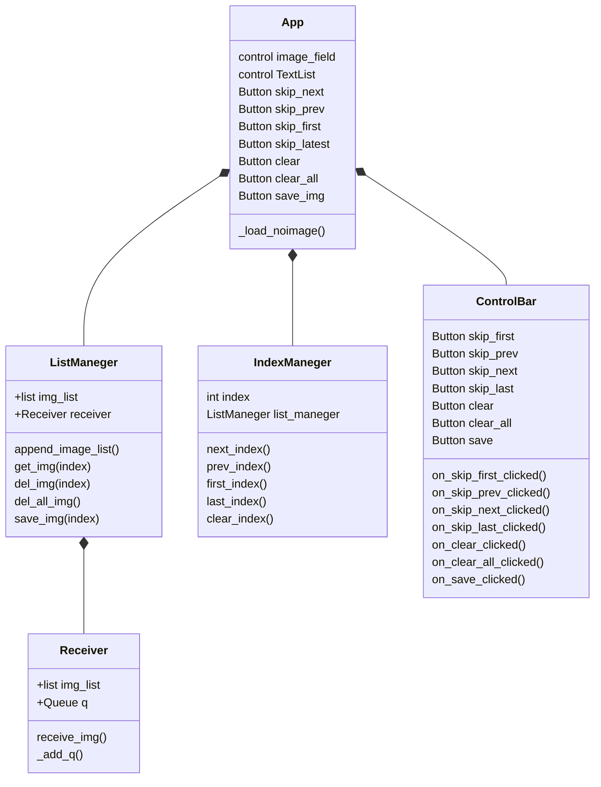

## クラス図

```mermaid
classDiagram
class ListManeger
ListManeger : +list img_list
ListManeger : +Receiver receiver
ListManeger : append_image_list()
ListManeger : get_img(index)
ListManeger : del_img(index)
ListManeger : del_all_img()
ListManeger : save_img(index)

class Receiver
Receiver : +list img_list
Receiver : +Queue q
Receiver : receive_img()
Receiver : _add_q()

class IndexManeger
IndexManeger : int index
IndexManeger : ListManeger list_maneger
IndexManeger : next_index()
IndexManeger : prev_index()
IndexManeger : first_index()
IndexManeger : last_index()
IndexManeger : clear_index()

class App
App : control image_field
App : control TextList
App : Button skip_next
App : Button skip_prev
App : Button skip_first
App : Button skip_latest
App : Button clear
App : Button clear_all
App : Button save_img
App : _load_noimage()

class ControlBar
ControlBar : on_skip_first_clicked()
ControlBar : on_skip_prev_clicked()
ControlBar : on_skip_next_clicked()
ControlBar : on_skip_last_clicked()
ControlBar : on_clear_clicked()
ControlBar : on_clear_all_clicked()
ControlBar : on_save_clicked()

ControlBar : Button skip_first
ControlBar : Button skip_prev
ControlBar : Button skip_next
ControlBar : Button skip_last
ControlBar : Button clear
ControlBar : Button clear_all
ControlBar : Button save

App *-- ListManeger
App *-- IndexManeger
App *-- ControlBar
ListManeger *-- Receiver
```